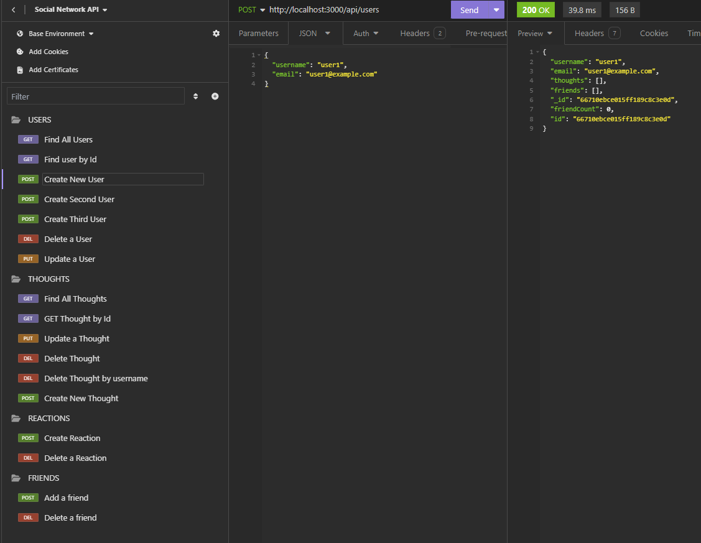

# NoSql Social Network API

# [WATCH WALKTHROUGH VIDEO HERE!!!](https://youtu.be/8-RdTYJd0i0)

## Table of Contents
- [Description](#description)
- [Installation](#installation)
- [Usage](#usage)
- [Contributors](#contributing)
- [Questions](#questions)

## Description
This project is about a social network web application where users can share their thoughts, react to friends’ thoughts, and create a friend list. It was done using Express.js for routing, a MongoDB database, and the Mongoose ODM.

## Installation
To install the application, navigate to the repository entitled: NoSql-Social-Network-API-Challenge. Once navigated, install necessary dependencies.

## Usage
To use the application, run command `npm start` or `node server.js` and test the APIs in insomnia or any other API testing application.

## Contributing
Contributions are welcome!!!

## Questions
  My GitHub profile is: Jenina52112 [View on GitHub](https://github.com/Jenina52112)

  For additional questions, contact me at email address: jenina52112@gmail.com
